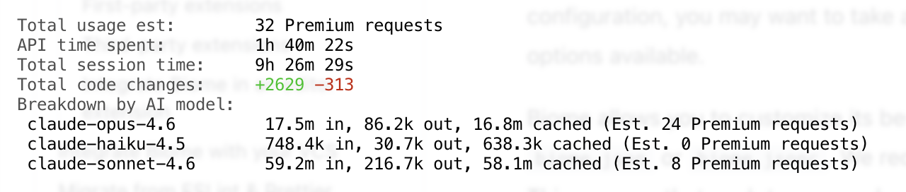

# Lessons from AI-assisted migration

I spent some time last weekend to migrate our monorepo (multiple apps and packages, almost 150k LOC) from ESLint and Prettier to [Biome](https://biomejs.dev/). This was my third attempt, largely driven by LLM efforts, thought I’d share what worked and what didn’t, short and sweet.

## What worked

- **Give it the same information you’d use yourself:** Biome documentation has detailed migration guides and recipes for various scenarios. I also fed the LLM the latest [schema.json](https://biomejs.dev/schemas/latest/schema.json) from the Biome config to help identify equivalent rule replacements. At least with Copilot CLI, it does not search the web unless explicitly prompted.
- **Preparation is half the battle:** research and planning are insanely helpful for complex tasks, in my previous two tries I’ve been using [spec-kit](https://github.com/github/spec-kit) but for the last one I’ve followed [the guide](https://github.com/github/spec-kit) from Boris Tane which is much less rigid and produced documentation that had minimal formal overhead.
- **Opt for rigid & measurable goals:** I remember being a "sweet summer child" during my first attempt, prompting Copilot to “migrate ESLint and Prettier to Biome” without any additional context. Copilot, left to interpret the measure of success, obviously didn’t deliver what I was expecting. Once I properly sat down and wrote down actual goals I was after (migrate individual configs, replace disabling comments and most importantly - keep the actual code changes under 5% percent) Copilot respected those, and the outcome improved significantly.

## What didn’t

- **Non-deterministic review:** asking LLM to “check for all the problems” yielded very plausible and often times correct suggestion but fell short from covering the full scope, for example for checking if all the eslint-disable comments were replaced by the comparable biome-ignore ones one would be better asking AI to write a script and then verifying it with control samples.
- **Using cheaper models for planning:** while they did came up with decent research and planning it still required a lot of feedback and manual adjustments.

Have you done something similar in the past and were happy with the outcome? Let me know the tricks you’ve used as I still need to upgrade all the apps to Next.js 15/16.
